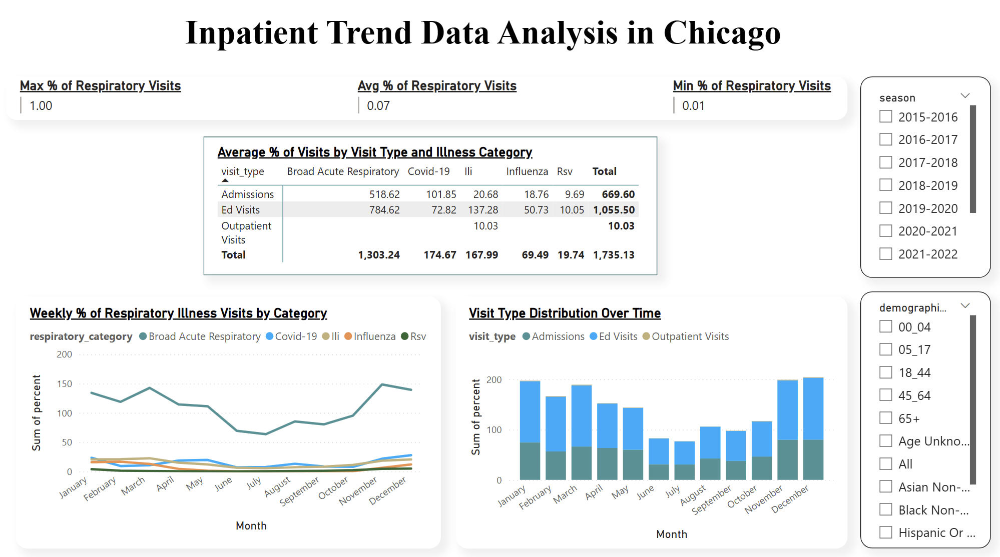
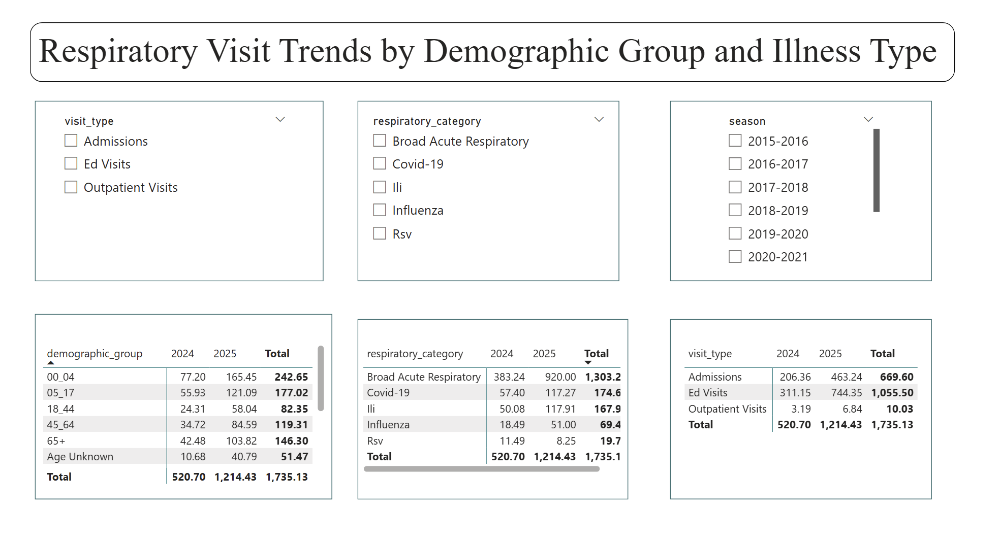
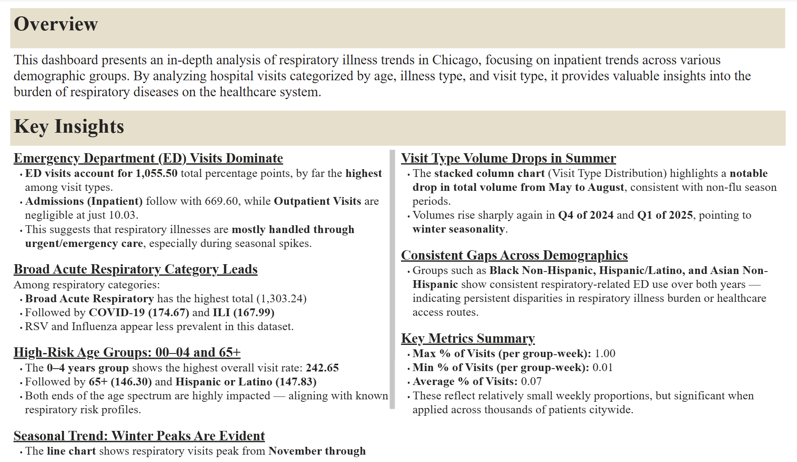

# Inpatient Trend Data Analysis Using Power BI

This project explores respiratory illness trends across different visit types and demographic groups in the City of Chicago. Using public health data, Python for data wrangling and time series decomposition, and Power BI for interactive dashboards, this analysis uncovers critical seasonal, demographic, and illness-specific patterns to inform public health planning.

---

## Project Structure

```
Inpatient-Trend-Analysis/
├── data/
│   ├── raw/                          # Original dataset from City of Chicago
│   └── cleaned/                      # Cleaned, aggregated, and decomposed data
├── scripts/
│   └── cleaned_data.ipynb         # Python data pipeline (cleaning, decomposition)
├── PowerBI/
│   └── Inpatient_Trend_Analysis.pbix # Power BI dashboard file
├── images/
│   ├── Inpatient_Trend_Analysis_Dashboard.png
    ├── Inpatient_Trend_Analysis_QR.jpg
    └── Respiratory_Visit_Trends.png 
├── README.md
└── .gitignore
```

---

## Tools & Technologies

- **Power BI** – for visual storytelling and dashboard design  
- **Python (Pandas, Statsmodels, Matplotlib)** – for data cleaning, time series analysis  
- **City of Chicago Public Health Dataset** – source for visit records  
- **GitHub** – version control and publishing

---

## Project Objective

To analyze inpatient, outpatient, and emergency department visits related to respiratory illnesses such as COVID-19, ILI, RSV, and Influenza, and provide insights into seasonal patterns, demographic disparities, and illness burden distribution.

---

## Power BI Dashboard Narrative

The Power BI dashboard is designed for public health analysts and hospital planners. It includes visuals for:

### 🔹 Weekly % of Respiratory Illness Visits by Category
Shows seasonal patterns and peaks across respiratory categories, with noticeable increases in the winter months (Nov–Feb).

### 🔹 Visit Type Distribution Over Time
Highlights the overwhelming share of visits handled by emergency departments.

### 🔹 Demographic Group Analysis
Breaks down visits by age, race, and ethnicity groups. Filters and matrix tables help pinpoint high-burden populations.

### 🔹 Category vs. Visit Type Matrix
Displays which illness types are most often associated with specific visit types (ED, Admissions, Outpatient).

### 🔹 Key Performance Indicators (KPI)
Cards showing minimum, maximum, and average visit percentages across all groups.

---

## Dashboard Screenshots

    



---

## Dashboard Access


---

## Key Insights

### Emergency Department (ED) Visits Dominate
- **ED visits:** 1,055.50 — highest among all visit types  
- **Admissions:** 669.60  
- **Outpatient:** Only 10.03  
→ EDs handle the bulk of respiratory illness burden, especially during peaks.

### Broad Acute Respiratory Category Leads
- **Broad Acute Respiratory:** 1,303.24 total
- **COVID-19:** 174.67
- **ILI:** 167.99
→ RSV and Influenza are comparatively lower in visit percentage.

### High-Risk Age Groups: 00–04 and 65+
- **Age 0–4:** 242.65 total visit percentage
- **Age 65+:** 146.30
- **Hispanic or Latino:** 147.83
→ The youngest and oldest are consistently the most impacted.

### Seasonal Trend: Winter Peaks Are Evident
- Visits peak in **November–February**
- Dip in **July–September**, then climb again  
→ Aligns with known flu and cold seasons.

### Visit Type Volume Drops in Summer
- May–August shows the **lowest volume**
- Sharp increase in **Q4 2024 and Q1 2025**  
→ Confirms winter seasonality in respiratory illness patterns.

### Consistent Gaps Across Demographics
- **Black Non-Hispanic**, **Hispanic/Latino**, and **Asian Non-Hispanic** groups show persistently high ED usage  
→ Indicates disparities in disease burden and/or care access.

### Key Metrics Summary
- **Max % of Visits (per group-week):** 1.00  
- **Min % of Visits (per group-week):** 0.01  
- **Average % of Visits:** 0.07  
→ Small percentages weekly, but significant when scaled across a city.

---

## Data Source

**City of Chicago – Respiratory Illness Surveillance**  
[https://data.cityofchicago.org](https://data.cityofchicago.org/Health-Human-Services/Inpatient-Emergency-Department-and-Outpatient-Visi/7ce8-bpr6/about_data)

---

## Use Cases

- Public health surge planning
- Hospital resource allocation
- Targeted outreach to vulnerable demographics
- Epidemiological reporting and presentations

---

## Future Enhancements

- Add year-over-year comparisons
- Include hospital location-level trends
- Connect to real-time API feeds if available

---

## Author

**Saran Mannam**  
Master’s in Computer Science, Illinois Institute of Technology  
Data Analyst | Power BI Developer | Data Science Enthusiast

---

## Connect with Me

Feel free to connect or reach out:

- LinkedIn: https://www.linkedin.com/in/mannam-saran-2001
- GitHub: https://github.com/Mannam-Saran
